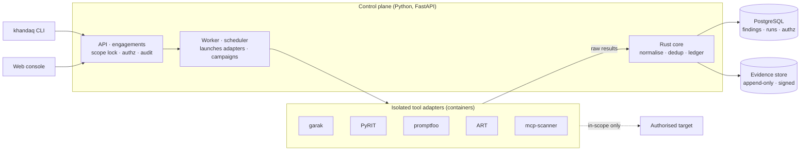

# Khandaq

**A command post for authorised AI red teaming.**

> *Khandaq* (الخندق): the trench. The defensive earthwork dug around Medina in 5 AH, on
> Salmān al-Fārisī's counsel, to meet a siege — attacker thinking in the service of defence.

Khandaq is a **self-hostable platform for authorised offensive AI security work**. It does not
invent attacks; it **orchestrates the maintained open-source tools** (garak, PyRIT, promptfoo,
DeepTeam, ART, model and MCP scanners), **unifies their findings** into one schema mapped to
MITRE ATLAS and the OWASP LLM & Agentic Top 10, keeps a **tamper-evident chain of evidence**,
produces **framework-mapped reports**, and turns a one-off engagement into a **continuous
campaign** that alerts you when a defence regresses.

It is built for the ten phases of the offensive-AI lifecycle an AI security professional works
through (the structure the EC-Council C|OASP curriculum follows), and it sits beside the other
Sīra Labs projects — [Thawr](https://github.com/Sira-Labs/Thawr) (self-hosted private network)
and [Tabayyun](https://github.com/Sira-Labs/Tabayyun) (time-series data-quality verification).

> ⚠️ **Authorised use only.** Khandaq runs offensive tooling against AI systems. Every run must
> belong to an engagement whose targets you are legally authorised to test. The scope lock and
> audit log exist to enforce that boundary — they are not optional. See [SECURITY.md](SECURITY.md)
> and `docs/architecture/04-engagement-scope-and-authz.md`.

## Why Khandaq exists

The tools are excellent and single-purpose. The *campaign* around them is missing:

- **No shared findings model** — each tool speaks its own format; nothing deduplicates across
  tools, agrees on severity, or maps a result to an ATLAS technique and an OWASP ID.
- **No chain of evidence** — the prompts, responses and artefacts that prove a finding scatter
  across temp directories; nothing binds them to an engagement or makes the record tamper-evident.
- **No enforced scope** — the tools trust whatever target you type; there is no shared
  authorisation boundary, and running them against the wrong host is a legal event.
- **No memory** — an engagement is a snapshot; nothing watches for the day a passing defence
  regresses.

Khandaq is the layer that supplies all four. See `docs/VISION.md`.

## What it is not

- Not a new attack framework. It wraps published tools; it ships no novel exploits.
- Not a tool for unauthorised testing. Out-of-scope runs are refused, not warned about.
- Not a SaaS. There is no hosted control plane; your evidence never leaves your infrastructure.
- Not a replacement for the upstream tools. They stay upstream; Khandaq commands them.

## Architecture at a glance

Decisions are recorded as ADRs in `docs/adr/`; the map is `docs/architecture/03-system-architecture.md`.

## Repository layout

| Path | What |
|---|---|
| `core/` | Rust workspace: findings canonicalisation, fingerprint/dedup, the hash-chained evidence ledger, and a PyO3 wheel the API uses. |
| `api/` | Python 3.12 FastAPI control plane (uv): engagements, scope lock, authz, audit, the worker and adapter host. |
| `adapters/` | One thin, version-pinned adapter per upstream tool; each builds to its own container image. |
| `web/` | Vite + React 19 + TanStack + Tailwind console. |
| `deploy/` | `docker compose` bundle, CapRover guide and captain-definitions, env examples. |
| `docs/` | Vision, architecture, ADRs, research, specs, roadmap and sprint plan. |

## Status

**R0 — design.** This repository currently holds the vision, architecture, research synthesis,
first ADRs, the opening specs, the roadmap and the deployment plan. Implementation begins with
sprint 1 (the engagement/scope spine, the findings model, the evidence ledger and the first
adapters). Follow `docs/roadmap/roadmap.md` and `TASKS.md`.

## Contributing & security

Read `CONTRIBUTING.md` (spec-driven workflow) and `docs/` before changing behaviour. Report
vulnerabilities privately — see `SECURITY.md`. Licence: Apache-2.0.

---

A <b>Sīra Labs</b> project · بسم الله الرحمن الرحيم

