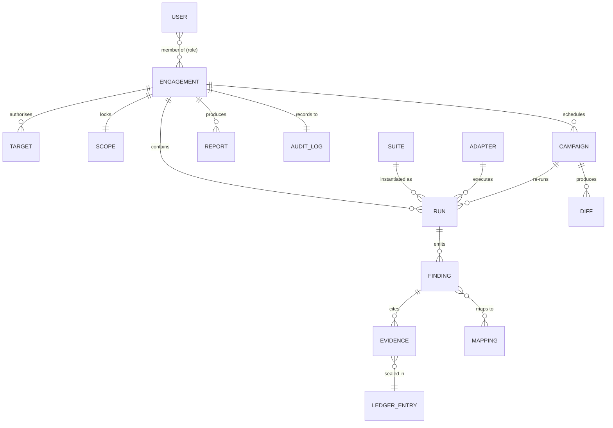

# Domain model

This is the shape of the data Khandaq manages. The **canonical finding** is the centre of the
product: every adapter produces findings in this shape, and everything else — dedup, severity,
framework mapping, evidence, reports, campaign diffs — operates on it. The schema is a **superset
of SARIF 2.1.0**, so results interoperate with existing security tooling, with AI-specific
extensions under an `x-khandaq` property.

## Entities



## Core entities

### Engagement
The unit of authorised work. Nothing runs outside one. It holds: a name and client/owner, its
**authorised targets**, its **rules of engagement**, a lifecycle state (`draft → active → closed`),
membership with roles, and references to its runs, campaigns, reports and audit log. Once `active`,
its scope is **locked** and changes to targets require a privileged, audited action.

### Target
An in-scope system an adapter may act against. A target is typed — `llm_endpoint` (base URL +
auth + model id), `agent` (entry point + tool manifest), `mcp_server` (transport + URL), `model_artifact`
(registry/path + digest), `dataset` (location + digest) — and carries only what an adapter needs to
reach it. **Credentials are referenced, never stored in the clear** (ADR-0006).

### Scope & RulesOfEngagement
`Scope` is the machine-checkable allow-list the scope lock enforces: exact hosts/URLs, model ids,
artefact digests, and explicit deny rules. `RulesOfEngagement` is the human contract: time windows,
rate limits, data-handling rules, prohibited techniques, and the authorisation reference (who signed
off). The scope lock (`04-engagement-scope-and-authz.md`) evaluates every run request against both
before any adapter starts. **Default deny.**

### Suite & Adapter
A `Suite` is a named, versioned bundle of adapter invocations for a phase (e.g. `prompt-injection`
runs garak + PyRIT + promptfoo with set parameters). An `Adapter` is the thin wrapper around one
upstream tool: an exact pinned version, an `adapter.yaml` manifest (phases covered, framework IDs it
can emit, resources), a container image, and a contract test. An adapter is the **only** sanctioned
way to add a tool.

### Run
One execution of one adapter within an engagement. It records the suite, adapter + version, target,
parameters, start/end, status, the raw tool output (archived to evidence), and the findings produced.
A run request is scope-checked **before** the adapter container starts; the container is given only
the one in-scope target it needs and no other network egress.

### Finding (canonical schema)
The heart of the model. Sketch (SARIF-superset; illustrative, not final — the JSON Schema lives at
`core/khandaq-core/schema/finding.schema.json`):

```jsonc
{
  "schema": "khandaq.finding/1",
  "fingerprint": "sha256:…",         // stable across tools & runs; basis for dedup (ADR-0003)
  "engagement_id": "eng_7af3",
  "run_id": "run_93c1",
  "rule_id": "garak.promptinject.hijack",   // source tool's rule/probe id
  "title": "Indirect prompt injection via retrieved document",
  "severity": "high",                 // normalised: info|low|medium|high|critical (ADR-0004)
  "confidence": "firm",               // tentative|firm|confirmed
  "target_ref": "tgt_gw1",
  "source": { "tool": "garak", "version": "0.17.0", "native_severity": "…" },
  "locations": [ /* SARIF locations: endpoint, parameter, agent step */ ],
  "x-khandaq": {
    "phase": "04-prompt-injection",
    "mappings": [
      { "framework": "atlas",        "id": "AML.T0051" },
      { "framework": "owasp-llm-2025", "id": "LLM01" },
      { "framework": "owasp-llm-2026", "id": "LLM01" },
      { "framework": "nist-ai-rmf",  "id": "MEASURE-2.7" }
    ],
    "evidence": [ "ev_a1", "ev_a2" ],   // ids into the evidence ledger
    "dedup_of": null,                   // set on the duplicates that collapse into a canonical one
    "first_seen_run": "run_93c1",
    "status": "open"                    // open|triaged|accepted-risk|fixed|false-positive
  }
}
```

**Fingerprint (ADR-0003):** a stable hash over the normalised {rule family, target, location,
salient request shape} so the same issue found by two tools, or by the same tool across runs,
collapses to one canonical finding with the others linked as `dedup_of`. This is what lets a report
say "3 high" instead of "17 raw results".

**Severity (ADR-0004):** each adapter maps its tool's native severity to Khandaq's five-level scale
via a documented table in its manifest, so severities are comparable across tools.

### Evidence & Ledger
`Evidence` is an artefact that proves a finding — a prompt/response pair, a transcript, a scanner
report, a captured payload — stored in the append-only object store, encrypted, and referenced by id.
Evidence is **sealed** into the **hash-chained ledger** (ADR-0007): each `LedgerEntry` carries the
hash of the evidence plus the hash of the previous entry, so the record is tamper-evident; a bundle
may be Sigstore-signed for external verification. Nothing deletes or mutates a sealed entry.

### Mapping
The cross-walk tables from a tool's rule id and a finding's nature to framework IDs: MITRE ATLAS,
OWASP LLM (2025 and 2026 kept in parallel), OWASP Agentic (ASI), NIST AI RMF, and EU AI Act
references. Shipped as versioned data (`core/khandaq-core/mappings/`), because no upstream tool
emits ATLAS IDs natively — building and maintaining this table is one of Khandaq's distinctive
contributions.

### Campaign & Diff
A `Campaign` schedules a suite to re-run against an engagement's targets. Each run produces a `Diff`
against the campaign baseline: findings `new`, `resolved`, `regressed` (a previously-resolved finding
reappears) or `unchanged`. A worsening diff raises an alert (email/webhook). This is how a snapshot
becomes continuous monitoring.

### Report
A rendered artefact for humans: a management summary (counts by severity and framework, trend) and a
technical report (each finding with evidence refs and mappings), exported to HTML/PDF/JSON plus a
MITRE ATLAS Navigator layer. A report pins the ledger root hash of the evidence it relies on, so it
is verifiable.

### User, Role, AuditLog
Users are authenticated via OIDC (ADR-0005). Authorisation is role-based **per engagement**
(`owner`, `operator`, `analyst`, `viewer`) on top of org-level roles, enforced server-side
(`04-engagement-scope-and-authz.md`). Every privileged action — creating/activating an engagement,
changing scope, starting a run, sealing/exporting evidence — writes an immutable `AuditLog` entry
(actor, action, engagement, timestamp, before/after where relevant).

## Identifiers & conventions
- Prefixed, URL-safe ids: `eng_`, `tgt_`, `run_`, `fnd_`, `ev_`, `cmp_`, `rpt_`.
- API timestamps are RFC 3339 UTC; the Rust core uses `i64` nanoseconds since epoch.
- All finding text is treated as untrusted (it contains attacker/model output); it is escaped on
  display and never interpolated into shell/SQL.
