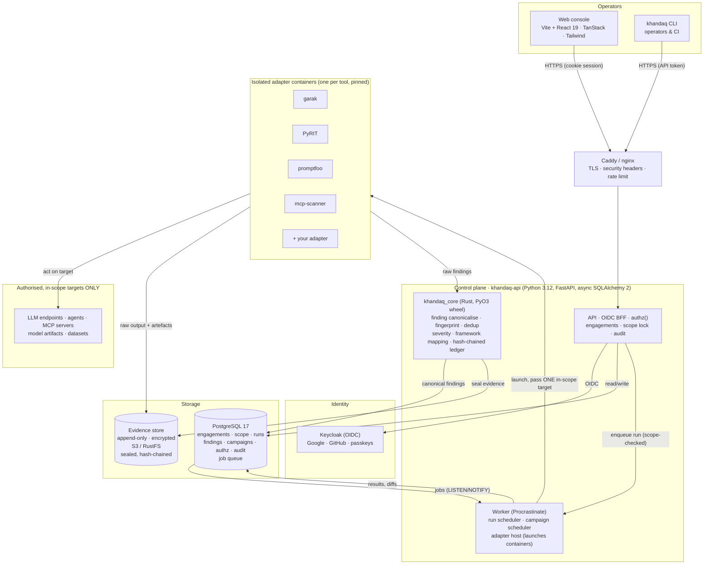

# System architecture

Decisions are recorded in `docs/adr/`. This document is the map. Research backing is in
`docs/research/`.

## Overview

## Components

### 1. `khandaq_core` (Rust, PyO3 wheel)

The integrity- and correctness-critical kernel, in Rust for safety and determinism, exposed to the
Python API as a wheel (`khandaq_core`) and as a `khandaq-core` CLI for offline use.

| Module | Responsibility |
|---|---|
| `finding` | The canonical finding type and its JSON Schema; (de)serialisation; validation of adapter output against the schema. |
| `fingerprint` | Stable fingerprint over the normalised finding (ADR-0003); the basis for cross-tool/cross-run dedup. |
| `dedup` | Collapse duplicate findings into a canonical one with links; merge evidence refs and source tools. |
| `severity` | Apply each adapter's native→canonical severity table; resolve conflicts deterministically. |
| `mapping` | Apply the versioned framework cross-walk tables (ATLAS, OWASP LLM 2025/2026, Agentic, NIST, EU AI Act); emit Navigator layers. |
| `ledger` | The append-only, hash-chained evidence ledger (ADR-0007): append, verify the chain, compute root, optional Sigstore signing. |
| `diff` | Campaign diffs: classify findings as new/resolved/regressed/unchanged against a baseline. |

Rules: the ledger never mutates or deletes; every module is pure where it can be; every one has unit
tests and property tests (e.g. fingerprint stability, chain verification).

### 2. `khandaq-api` (Python, FastAPI)

| Package | Responsibility |
|---|---|
| `auth` | OIDC Authorization-Code + PKCE against Keycloak; server-side session store; `__Host-` cookie; CSRF check; API tokens for CLI/CI. |
| `authz` | Org roles + per-engagement roles; `authorize()` dependency; enforced server-side on every route. |
| `engagements` | Engagement lifecycle, targets, membership. |
| `scope` | **The scope lock.** Evaluates every run request against the engagement's `Scope` + `RulesOfEngagement` before enqueue. Default deny. Tested. |
| `audit` | Append-only audit log; a decorator/dependency that records every privileged action. |
| `runs` | Create runs, enqueue (post-scope-check), track status. |
| `adapters` | Adapter registry (reads `adapter.yaml` manifests); the **adapter host** that launches each adapter container with exactly one in-scope target and constrained egress. |
| `findings` | Persist canonical findings from the core; the findings inbox API; triage/status. |
| `campaigns` | Schedule suites; invoke the core's diff; raise alerts. |
| `reports` | Render management + technical reports; pin the ledger root. |
| `worker` | Procrastinate worker: run execution, campaign scheduling (ADR-0008). |

### 3. `adapters/<tool>` (containers)

Each adapter: a `Dockerfile` pinned to an exact upstream version, a thin wrapper that takes a
scope-checked run request and emits canonical findings + evidence to a mounted volume, an
`adapter.yaml` manifest, and a contract test against a recorded fixture. Isolation (ADR-0009): no
network egress except to the single in-scope target the control plane passes; a read-only rootfs
where the tool allows; its own resource limits. Adapters never see other engagements' data.

### 4. `web` (React SPA)
Vite + React 19 + TanStack Router/Query + Tailwind. Engagements list, engagement detail (scope,
members, runs), run launcher (suite picker), findings inbox (grouped, deduped, filterable by
severity/framework/phase), campaign dashboard (trend, diffs), report export. Cookie-session BFF;
no tokens in the browser.

## Key data flows

**A run, end to end.** Operator picks a suite → API builds run requests → **scope lock** checks each
against the engagement scope+RoE (reject out-of-scope, audited) → worker launches each adapter
container with one in-scope target and constrained egress → adapter runs the tool, writes raw output
+ artefacts to evidence, emits raw findings → core validates, fingerprints, dedups, maps to
frameworks, seals evidence into the ledger → canonical findings persisted → appear in the inbox.

**A campaign.** Scheduler enqueues the suite on its cadence → runs execute as above → core diffs
against the baseline → worsening diff → alert; dashboard trend updates.

**A report.** API assembles canonical findings + evidence refs → renders summary + technical report
→ pins the ledger root hash → exports HTML/PDF/JSON + Navigator layer.

## Deployment shape
One `docker compose up` for self-hosting (control plane, Postgres, an S3-compatible store, Keycloak
optional for single-user), or CapRover with staging/production separation (`deploy/caprover.md`,
ADR-0010). Adapter images are published to GHCR; the worker pulls the pinned image per adapter.
Air-gapped installs mirror the adapter images into a local registry.
