# Engagement, scope lock, authorisation and audit

These are the controls that make Khandaq safe to exist. They are not features bolted on; they are
the reason the orchestration layer is legitimate. This document is the design; the implementation in
`api/src/khandaq/scope/`, `api/src/khandaq/authz/` and `api/src/khandaq/audit/` must match it, and
its invariants are covered by tests.

## Principle: default deny, enforced server-side, always audited

1. **Nothing runs outside an engagement.** There is no "quick scan" path that bypasses an engagement,
   its scope and its audit log.
2. **The scope lock is server-side and runs before any adapter starts.** The web console and CLI are
   conveniences; the authoritative check is in the API, on the run-request path, and cannot be
   skipped by a crafted client.
3. **Default deny.** A target is in scope only if it matches an explicit allow rule and no deny rule.
   Anything ambiguous is rejected.
4. **Every privileged action is audited**, append-only, before/after where relevant.

## The engagement lifecycle

```mermaid
stateDiagram-v2
    [*] --> draft
    draft --> active: activate (owner; requires scope + RoE + authorisation ref)
    active --> active: run suites, schedule campaigns
    active --> closed: close (owner)
    draft --> closed: abandon
    closed --> [*]
```



- **draft** — scope and rules of engagement are being written; no runs allowed.
- **active** — scope is **locked**. Runs and campaigns are allowed. Changing an authorised target is
  a privileged, audited action that records the before/after and the actor, and is only permitted to
  the engagement `owner`.
- **closed** — read-only. Reports and evidence remain verifiable; no new runs.

## Scope: what the lock checks

An engagement's `Scope` is a machine-checkable document. Every run request carries a resolved target;
the lock evaluates it against the scope **and** the rules of engagement before the run is enqueued.

```yaml
# illustrative scope (stored per engagement, immutable once active except via audited change)
version: 1
allow:
  llm_endpoint:
    - host: gw.acme.test            # exact host; no wildcards by default
      paths: ["/v1/chat/completions"]
      models: ["acme-assistant-v3"]
  mcp_server:
    - url: "https://tools.acme.test/mcp"
  model_artifact:
    - digest: "sha256:…"            # artefacts matched by digest, not name
deny:
  - host: "*.prod.acme.com"          # explicit, overrides any allow
rules_of_engagement:
  windows: ["Mon-Fri 09:00-18:00 Europe/Zurich"]
  max_requests_per_minute: 60
  prohibited_techniques: ["data-exfiltration-to-third-party"]
  data_handling: "evidence stays in this Khandaq instance; no third-party LLM judges"
  authorisation_ref: "SOW-2026-114, signed 2026-10-01"   # the human authority for this engagement
```

The lock's algorithm (per run request): resolve the target → it MUST match an `allow` rule for its
type → it MUST NOT match any `deny` rule → the current time MUST fall in a RoE window → the run's
configured rate MUST be within the RoE limit → the suite MUST NOT use a prohibited technique. Any
failure → reject, write an audit entry (`run.rejected`, with reason), return a clear error. No
adapter container is started.

**Egress containment.** When a run passes, the adapter container is launched with network access
constrained to the single in-scope target of that run (ADR-0009). Even a misbehaving or compromised
adapter cannot reach a host outside the authorised scope, because the isolation is enforced below the
adapter, by the host.

## Authorisation model

Two layers, both enforced server-side by an `authorize()` dependency on every route:

- **Org roles:** `admin` (manage users, org settings), `member` (create engagements), `read-only`.
- **Per-engagement roles:** `owner` (activate/close, change scope, manage members), `operator` (start
  runs, schedule campaigns), `analyst` (triage findings, write reports), `viewer` (read).

A user's effective permission is the intersection of a valid session (OIDC, ADR-0005) and an explicit
role grant on the engagement. There is no implicit cross-engagement access: an analyst on engagement
A cannot read engagement B's findings or evidence.

## Audit log

Append-only, stored in Postgres, never updated or deleted from the application. Every privileged
action records: actor (user id + token id if via API), action, engagement id, timestamp (server UTC),
and before/after state for mutations. Audited actions include at least: engagement create/activate/
close, scope change, member change, run start, **run rejected by the scope lock (with reason)**,
evidence seal, report export, and any auth/role change. The audit log is readable by engagement
`owner`s and org `admin`s; it is covered by the evidence-integrity guarantees where it concerns
sealed artefacts.

## Evidence integrity (summary; full design in ADR-0007)

Captured evidence is written append-only to the object store, encrypted at rest, and **sealed** into a
hash-chained ledger: each entry binds the evidence hash to the previous entry's hash. The chain can be
verified at any time; a report pins the root hash of the evidence it relies on. Optional Sigstore
signing lets an external party verify a bundle without trusting the Khandaq instance. Nothing in the
application deletes or mutates a sealed entry; a change that could is a security defect (SECURITY.md).

## Why this is the product

Remove these controls and Khandaq is just a way to point attack tools at arbitrary systems with no
record — which is neither legitimate nor useful to a professional. With them, it is a disciplined
command post: every action authorised, bounded, and provable after the fact. That discipline is the
differentiator as much as the orchestration is.
